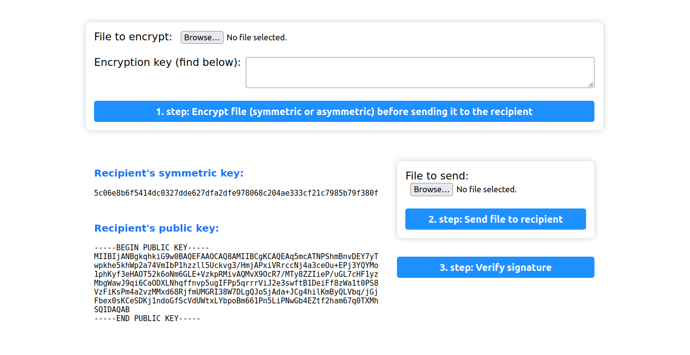

# Crypthography

## Setup

1. Install PHP 8.2
2. Open terminal in the project root directory and run `php -S localhost:8000` command in terminal
3. Open `http://localhost:8000` in browser
4. Connect to the Internet because of JQuery

You should see the following screen:

## Scenario

1. Alice wants to send a file to Bob, but she wants to encrypt the file before sending it to Bob
2. Bob sends his public key to Alice, and they agree on a symmetric key (showed on the main screen)
3. In the first form, Alice selects a file, choose the key to use and clicks on the "Encrypt file" button, and she gets an encrypted file made on her client side
4. In the second form, Alice selects the encrypted file and clicks on the "Send file" button, and she sends the encrypted file to Bob
5. Bob decrypts the file with his private key or the symmetric key, and he gets the Alice's original file
6. Bob edits Alice's file and signs it with his private key
7. Bob sends edited Alice's file and his digital signature to Alice
8. Alice verifies Bob's digital signature with Bob's public key, and she gets the message that the signature is valid or not to be sure that the file is from Bob and that the file is not changed

## Symmetric Crypthography (AES cryptography)

1. Used for symmetric key generation (PHP):

   - `random_bytes` https://www.php.net/manual/en/function.random-bytes.php

2. Used for symmetric encryption (JavaScript - WebCrypto):

   - `crypto.getRandomValues` https://developer.mozilla.org/en-US/docs/Web/API/Crypto/getRandomValues
   - `crypto.subtle.importKey` https://developer.mozilla.org/en-US/docs/Web/API/SubtleCrypto/importKey
   - `crypto.subtle.encrypt` https://developer.mozilla.org/en-US/docs/Web/API/SubtleCrypto/encrypt

3. Used for symmetric decryption (PHP - OpenSSL):

   - `openssl_decrypt` https://www.php.net/manual/en/function.openssl-decrypt.php

## Asymmetric Encryption (RSA cryptopsystem)

1. Used for asymmetric key generation (PHP - OpenSSL):

   - `openssl_pkey_new` https://www.php.net/manual/en/function.openssl-pkey-new.php
   - `openssl_pkey_export_to_file` https://www.php.net/manual/en/function.openssl-pkey-export-to-file.php
   - `openssl_pkey_get_details` https://www.php.net/manual/en/function.openssl-pkey-get-details.php

2. Used for asymmetric encryption (JavaScript - WebCrypto):

   - `crypto.subtle.importKey` https://developer.mozilla.org/en-US/docs/Web/API/SubtleCrypto/importKey (it is necessary to use SHA-1 as the hash function, because of the padding `OPENSSL_PKCS1_OAEP_PADDING` in PHP OpenSSL decryption function)
   - `crypto.subtle.encrypt` https://developer.mozilla.org/en-US/docs/Web/API/SubtleCrypto/encrypt (it is only possible to encrypt a small amount of data (190 bytes in this case - https://crypto.stackexchange.com/questions/42097/what-is-the-maximum-size-of-the-plaintext-message-for-rsa-oaep, so it is necessary to use a symmetric encryption algorithm to encrypt the data and then encrypt the key with the public key)

3. Used for asymmetric decryption (PHP - OpenSSL):

   - `openssl_pkey_get_private` https://www.php.net/manual/en/function.openssl-pkey-get-private.php
   - `openssl_private_decrypt` https://www.php.net/manual/en/function.openssl-private-decrypt.php
   - `openssl_error_string` https://www.php.net/manual/en/function.openssl-error-string.php

## Digital Signature

Used for digital signature:
   - PHP - OpenSSL
     - `openssl_sign` https://www.php.net/manual/en/function.openssl-sign.php (this is more efficient to use for signing the message digest, but I did not use it because I needed to save message digest and signature in the separate files, so I used `openssl_digest` and `openssl_private_encrypt` functions instead)
     - `openssl_digest` https://www.php.net/manual/en/function.openssl-digest.php
     - `openssl_pkey_get_private` https://www.php.net/manual/en/function.openssl-pkey-get-private.php
     - `openssl_private_encrypt` https://www.php.net/manual/en/function.openssl-private-encrypt.php
     - `openssl_pkey_get_public` https://www.php.net/manual/en/function.openssl-pkey-get-public.php
     - `openssl_public_decrypt` https://www.php.net/manual/en/function.openssl-public-decrypt.php
   - JavaScript - WebCrypto (tryed to decrypt or verify on client side, but it did not work, so I did it on the server side)
     - `crypto.subtle.importKey` https://developer.mozilla.org/en-US/docs/Web/API/SubtleCrypto/importKey
     - `crypto.subtle.verify` https://developer.mozilla.org/en-US/docs/Web/API/SubtleCrypto/verify (this is more efficient to use for verifying the digital signature, but because I did digital signing manually with `openssl_digest` and `openssl_private_encrypt` functions in PHP, so I did verify manually with `crypto.subtle.digest` and `crypto.subtle.decrypt` functions)
     - `crypto.subtle.digest` https://developer.mozilla.org/en-US/docs/Web/API/SubtleCrypto/digest
     - `crypto.subtle.decrypt` https://developer.mozilla.org/en-US/docs/Web/API/SubtleCrypto/decrypt
